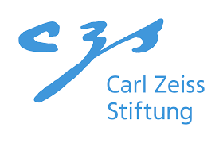

# Project Oveview
*Runtime: 4/26-10/29*

Increasingly powerful AI models also increase their resource requirements (computing power, storage space, energy). Many end devices cannot meet these resource requirements, which is why AI models are often mapped in the cloud. The constant communication between the end device and the cloud leads to high energy consumption, impaired privacy and model availability.

The "Lab2Device" project is developing an approach that makes it easier for companies to optimize their AI models for use in resource-limited end devices. To this end, methods are used that compress existing models and search for new, more powerful AI models under resource constraints. The project investigates whether these methods are suitable for creating resource-efficient AI models and the resource costs involved. In addition, the influence of the methods on other, user-centered target variables such as data economy and reliability of model predictions will be investigated.

The methods are developed on the basis of two representative use cases (battery diagnosis and humanoid robotics). The transfer of the knowledge and developments gained will be validated using applications and end devices of the cooperation partners.
 
## Funding
&nbsp;&nbsp;&nbsp;

This project is funded by the [Carl Zeiss Stiftung](https://www.carl-zeiss-stiftung.de/en/project-overview/detail/lab2device-from-the-prototyping-lab-to-the-resource-limited-embedded-device#:~:text=The%20%22Lab2Device%22%20project%20is%20developing%20an%20approach,models%20for%20use%20in%20resource%2Dlimited%20end%20devices.)

## Partners
&nbsp;&nbsp;&nbsp;

## People
### Coordinator
* **Prof. Dr. Christian Reich-Haag**
  * contact: *christian.reich-haag-at-hs-offenburg.de* 

### PI
* **Prof. Dr. Wolfgang Bessler**
* **Prof. Dr. Stefan Hensel**
* **Prof. Dr.-Ing. Janis Keuper**
  * Neural Architecture Search, Tiny Recursive Models
  * [Institute for Machine Learning and Analytics](https://imla.hs-offenburg.de) | [Keuper Lab](https://www.keuper-labs.org)
* **Prof. Dr. Stefan Hensel**
* **Prof. Dr. Axel Sikora**

### PostDocs
* **Dr. Johanna Naumann**

### PhD Students
* **Henrik Pichler, MSc**
* **Pascal David Leuthner, MSc**

